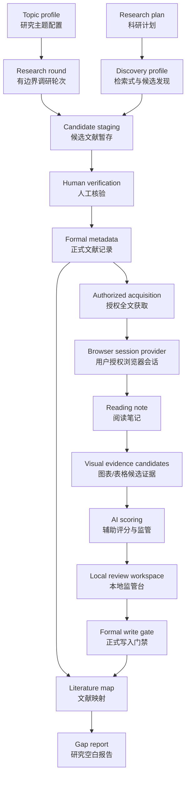

# RSA Research Agent Harness

面向科研文献调研的本地优先 agent harness。它用 Markdown/YAML、CLI 和显式人工确认，把“候选文献 -> 正式元数据 -> 阅读笔记 -> 文献映射 -> 研究空白报告”串成一条可审计、可回滚、可长期维护的证据链。


## 为什么需要它

LLM/agent 很适合辅助文献调研，但科研记录不能被未核验的模型判断污染。RSA 的核心目标是：让 agent 的每一步输出都能追溯到来源、状态和人工确认。

这个项目适合：

- 博士课题、长期科研项目和文献综述整理。
- 需要保留 PDF、截图、阅读笔记和研究判断依据的本地工作流。
- 希望使用 agent 提速，但不希望 agent 自动写入正式科研记录的场景。

## 核心能力

| 能力 | 说明 |
|------|------|
| Topic profile | 用 YAML 定义研究主题、关键词、优先问题、指标和排除范围。 |
| Research round | 创建有边界的文献调研轮次，保留目标、限制、候选和追踪摘要。 |
| Metadata gate | 只有经过人工确认的文献才能进入 `metadata/P###.yaml`。 |
| Candidate staging | 候选文献和核验记录先停留在 staging，不会自动进入正式记录。 |
| Literature map | 将已验证文献映射到 topic、priority question、章节和计划产出。 |
| Reading note | 只基于本地、用户提供或已授权全文创建单篇阅读笔记；`rsa note draft` 可生成中文自动阅读草稿和监管包。 |
| Visual evidence candidates | `rsa visual extract` 从已授权/本地 PDF 提取图表/表格候选、裁图和本地上下文包；候选 YAML 进入 staging/review，不是正式科研记录。 |
| Campaign foundation | `rsa campaign create/import/validate/status` 管理批量候选队列、轻量去重和正式 metadata 链接；作为 Phase 11 的批量入口。 |
| Campaign batch review | `rsa campaign run/resume/pause/queue/report` 把 campaign 队列接入单篇 workflow、metadata intake、review queue 和中文批量报告；自动运行到监管队列，正式写入仍需人工确认。 |
| AI scoring | `rsa score` 融合 reading note、视觉候选和 campaign 队列，生成 relevance、quality、read priority 三类 0-10 辅助评分；只用于排序、初审和监管。 |
| Workflow orchestrator | `rsa workflow run/resume/status/report/stop/rerun` 把单篇论文顺序跑到 review packet，保留中文状态、可恢复 run state 和 Phase 11 可复用的 campaign 字段。 |
| Local review workspace | `rsa review build/status/open/clean` 生成本地静态监管台，集中查看 campaign、单篇 workflow、reading note、visual evidence、AI scoring 和 formal write request。 |
| Writing safety | `rsa safety check/validate/status/campaign` 生成 claim-level citation review 和 campaign failure monitor；结果只进入 safety 审计记录，不是正式学术结论。 |
| Background worker | `rsa worker enqueue/run/status/logs/schedule` 把 campaign、review workspace 和 safety 任务放入本地队列或定时入队；worker 只推进 staging/review 自动化，不执行 formal write。 |
| Codex OAuth LLM provider | `rsa llm codex status/import/clear` 管理可选 `codex_oauth` provider，让 RSA 在本地凭据可用时把 Codex/ChatGPT 账号会话用于 reading draft；凭据 local-only，AI 产物仍只进入 staging/review。 |
| Source ledger | 登记本地、用户提供、open access 或已授权全文来源，不自动修改正式 metadata。 |
| Authorized acquisition | 根据正式 metadata 自动发现、审查并下载规则允许的授权 PDF，保留候选、ledger、hash 和中文原因。 |
| Browser session provider | 用户可在本地受控浏览器中登录自定义资料库，RSA 复用 `.rsa/sessions/` 中的本地 session 下载用户有权限访问的直接 PDF。 |
| Research plan discovery | `rsa discovery run` 把科研计划、临时研究目标或 topic profile 转成可审计检索式、候选结果和 campaign staging 队列。 |
| Asset manifest | 登记截图、图表、结果图和补充资产，真实文件 local-only，manifest 可审计。 |
| Formal write guardrails | 正式写入必须通过 schema 校验、冲突检查和显式人工确认。 |
| Environment doctor | `rsa doctor` 检查核心 Python 依赖、Playwright Chromium、provider 配置和修复建议，统一输出 `OK` / `WARN` / `BLOCKED`。 |
| Harness evals | 用本地 deterministic fixtures 检查回归、越界写入和格式漂移。 |

## 语言策略

RSA 当前主要面向中文用户，因此所有用户可见内容都应中文优先：CLI help、成功提示、错误信息、README、GSD 文档、模板说明、报告正文和人工确认提示都要让中文用户能直接理解。

字段名、YAML key、Markdown 表格列、CLI flag、命令名、状态枚举和代码标识保持英文稳定；但只要它们出现在用户需要阅读或填写的位置，就必须配有中文说明或中文上下文。

## 工作流



## 安装

```powershell
# 克隆仓库后进入项目目录
cd RSA

python -m venv .venv
.\.venv\Scripts\Activate.ps1
python -m pip install -e ".[dev]"

rsa --help
```

基础安装包含当前核心闭环需要的 Python 依赖：`PyYAML` 用于 YAML 记录，`pypdf` 用于正文文本提取，`PyMuPDF` 用于 Phase 8.1 图表/表格视觉候选裁图，`playwright` 用于用户授权浏览器会话控制。缺少核心依赖时，相关命令会 fail closed，并给出中文修复提示。

需要浏览器登录资料库时，还需要一次性安装 Playwright Chromium 运行资源：

```powershell
python -m playwright install chromium
```

检查当前环境：

```powershell
rsa --root . doctor
rsa --root . doctor --json
```

`rsa doctor` 会列出 `OK`、`WARN`、`BLOCKED` 状态、受影响命令和中文修复建议。自动化脚本需要阻塞失败时可使用 `rsa --root . doctor --strict`。

### 功能-依赖矩阵

| 功能 | 安装层 | 依赖/资源 | 缺失时行为 |
|------|--------|-----------|------------|
| Markdown/YAML harness、metadata、map、gap | 基础安装 | `PyYAML` | `BLOCKED`，中文提示重新安装基础依赖。 |
| 自动阅读草稿 `rsa note draft` | 基础安装 | `pypdf`、授权 PDF 或本地全文 | `BLOCKED` 或 `partial`，不生成伪阅读结论。 |
| 视觉证据候选 `rsa visual extract` | 基础安装 | `PyMuPDF`、授权 PDF 或本地全文 | `BLOCKED`，不生成伪图表证据。 |
| 浏览器会话 `rsa source login` | 基础安装 + 一次性环境初始化 | `playwright`、`python -m playwright install chromium`、用户手动登录 | `BLOCKED`，输出中文修复命令，不保存密码。 |
| 科研计划发现 `rsa discovery run` | 基础安装 | `PyYAML`、合法 provider；`--no-search` 可离线生成检索式 | provider 不可用时 fail closed，不创建伪候选。 |
| Codex OAuth provider | 可选配置 | 本机 Codex CLI auth、`.rsa/auth/codex_oauth.yaml` | `WARN` 或 `BLOCKED`，不输出 token，不生成伪 AI 产物。 |
| 开发测试 | `.[dev]` | `pytest` | 只影响贡献者本地验证，不影响普通用户核心流程。 |

`.[browser]` extra 目前只作为兼容旧安装说明的别名保留；核心浏览器 Python 包已经在基础安装中。未来 `.[ui]`、`.[llm]`、`.[cloud]` 等 extras 只用于非核心增强。

如果没有安装 editable package，也可以用：

```powershell
python -m rsa_cli.cli --help
```

## 快速体验

初始化本地文献工作区：

```powershell
rsa --root . init
```

校验内置 SAR starter profile：

```powershell
rsa --root . validate-profile 01_literature/topic_profiles/sar_noncontinuous_aperture.yaml
```

创建一个有边界的调研轮次：

```powershell
rsa --root . new-round `
  --topic 01_literature/topic_profiles/sar_noncontinuous_aperture.yaml `
  --objective "调研间断孔径 SAR 文献" `
  --name "gap sar starter"
```

校验并生成追踪摘要：

```powershell
rsa --root . round validate R001_gap_sar_starter
rsa --root . round trace R001_gap_sar_starter
```

运行 harness 回归检查：

```powershell
rsa --root . eval run
rsa --root . eval compare
```

从科研计划生成可审计候选文献队列：

```powershell
rsa --root . discovery run --plan-file research_plan.md --provider openalex
rsa --root . discovery validate DR001
rsa --root . discovery status DR001
```

## 常用命令

| 命令 | 作用 |
|------|------|
| `rsa init` | 创建本地文献工作区结构和模板。 |
| `rsa validate-profile` | 校验 topic profile YAML。 |
| `rsa new-round` | 创建有边界的文献调研轮次。 |
| `rsa round validate` | 只读校验 round archive。 |
| `rsa round trace` | 生成或刷新 `trace_summary.md`。 |
| `rsa add-paper` | 通过人工确认写入正式 metadata。 |
| `rsa validate-index` | 校验 `paper_index.md` 是否与 metadata 一致。 |
| `rsa regenerate-index` | 根据 metadata 重建文献索引。 |
| `rsa map validate` | 只读校验 `literature_map.md`。 |
| `rsa map propose` | 从 round 输出生成 map 建议，不写正式记录。 |
| `rsa gap generate` | 生成研究空白报告。 |
| `rsa note create` | 从已授权全文创建空白/结构化 reading note。 |
| `rsa note draft` | 从 source ledger 或显式 `--source-file` 生成中文自动阅读草稿、AI 初审分和 review packet。 |
| `rsa source add` / `validate` / `status` | 登记、校验或查看本地/已授权全文来源。 |
| `rsa source find` | 自动发现、审查并默认下载规则允许的授权全文来源。 |
| `rsa source candidates` | 只读查看候选来源、匹配证据、授权模式和中文原因。 |
| `rsa source download` | 下载最佳候选、指定候选，或显式下载用户授权 URL。 |
| `rsa source login` | 打开 `browser_session` provider 登录页，用户手动登录后保存本地 session。 |
| `rsa source session status` / `clear` | 只读查看或清除 `.rsa/sessions/` 下的本地 browser session。 |
| `rsa asset add` / `validate` / `status` | 登记、校验或查看截图、图表和结果图资产。 |
| `rsa visual extract P001` | 从已授权/本地 PDF 生成图表/表格视觉证据候选、裁图和本地上下文包。 |
| `rsa visual validate P001` / `status P001` | 只读校验或查看 `visual_evidence_candidates.yaml`，不修改正式记录。 |
| `rsa campaign create` | 创建批量候选队列，写入 `01_literature/campaigns/C###.yaml`。 |
| `rsa campaign import C001 --file candidates.csv` | 导入 CSV/TSV/YAML 候选，做 DOI/URL/title-year-author 轻量去重和正式 metadata 链接。 |
| `rsa campaign validate C001` / `status C001` | 只读校验或查看批量队列状态、重复项、阻塞项和已链接项。 |
| `rsa campaign run C001` | 运行 campaign 批量流水线；`linked` 项进入单篇 workflow，`queued` 项生成 metadata intake request。 |
| `rsa campaign run C001 --dry-run` | 只生成 run ledger、review queue 和 batch report，不实际运行 workflow。 |
| `rsa campaign resume C001` / `pause C001` | 恢复未完成项或暂停 campaign run；已完成 staging 项不会重复运行。 |
| `rsa campaign queue C001` | 生成监管队列，按 blocked、partial、needs_review、auto_triaged、high_priority、low_confidence 等分组。 |
| `rsa campaign queue review C001 --item QI001 --decision accepted --reviewer zxy` | 记录监管队列决策；`accepted` 不是 formal approval。 |
| `rsa campaign report C001` | 生成中文批量报告，汇总自动化状态、异常、监管队列和正式写入边界。 |
| `rsa score P001` | 生成单篇论文 Phase 9 AI 辅助评分和中文监管包。 |
| `rsa score validate P001` / `status P001` | 只读校验或查看 scoring YAML，不修改正式记录。 |
| `rsa score campaign C001` | 对已链接正式 metadata 的 campaign 条目批量生成 scoring summary。 |
| `rsa score review P001` | 记录人工监管或纠正结果，追加 `review_history`，不写 formal records。 |
| `rsa workflow run P001` | 串联 acquisition、reading draft、visual extraction、scoring 和 review packet，自动跑到需要监管的位置。 |
| `rsa workflow status P001` / `report P001` | 只读查看最近一次 workflow run 的状态、步骤、下一步建议和中文监管包。 |
| `rsa workflow resume P001` / `rerun P001` / `stop P001` | 显式恢复、重跑指定步骤或暂停单篇 workflow；campaign 批量调度属于 Phase 11。 |
| `rsa review build --campaign C001` | 生成 campaign 级本地静态监管台，聚合 review queue、metadata intake、batch report 和 formal write request。 |
| `rsa review build --paper P001` | 生成单篇 paper 级本地静态监管台，聚合 metadata、source ledger、reading note、workflow、visual evidence 和 scoring。 |
| `rsa review status` / `open` | 只读查看最近监管台状态，或打开最近生成的 `index.html`。 |
| `rsa review clean --generated-only` | 清理生成的 HTML、manifest 和 checklist，保留人工记录。 |
| `rsa safety check P001` | 生成单篇论文写作安全检查，抽取 claim_ref 并检查引用链是否能回到原文证据。 |
| `rsa safety validate P001` / `status P001` | 只读校验或查看 `P###_safety.yaml`，不修改正式记录。 |
| `rsa safety campaign C001` | 生成 campaign failure monitor，检查批量异常聚合、formal request 非自动执行和 metadata intake 边界。 |
| `rsa worker enqueue campaign-run C001` | 把 campaign run 任务放入本地 worker queue，不立即执行。 |
| `rsa worker run --max-tasks 1` | 按队列顺序执行本地 worker 任务；单个失败会记录并继续处理后续任务。 |
| `rsa worker run --include-due --max-tasks 5` | 先把到期 schedule 入队，再执行最多 5 个 queued 任务。 |
| `rsa worker status` / `logs` | 查看 worker queue、schedule 概览和中文日志摘要。 |
| `rsa worker schedule add campaign-run C001 --interval-hours 24` | 新增本地定时入队规则；schedule 只入队，不直接执行任务。 |
| `rsa llm codex status` | 只读检查可选 `codex_oauth` provider、RSA auth store 和 Codex CLI auth.json 状态；不会输出 token。 |
| `rsa llm codex import` | 从本机 Codex CLI auth.json 导入 RSA 本地-only 凭据副本到 `.rsa/auth/codex_oauth.yaml`。 |
| `rsa llm codex clear` | 删除 RSA 本地 codex_oauth 凭据副本；不修改 Codex CLI 登录状态。 |
| `rsa discovery run` | 从科研计划、临时目标或 topic profile 生成 discovery profile、检索式、候选结果和 campaign staging 导入。 |
| `rsa discovery validate` / `status` | 只读校验或查看 discovery 产物，不写正式记录。 |
| `rsa doctor` | 检查本地环境、核心依赖、外部运行资源和 provider preflight，输出中文修复建议。 |
| `rsa doctor --strict` | 发现 `BLOCKED` 项时返回非零退出码，适合 CI 或自动化检查。 |
| `rsa formal apply-map` | 经人工确认后写入正式 literature map。 |
| `rsa formal apply-note` | 经人工确认后写入 note 派生的正式记录。 |
| `rsa eval run` / `baseline` / `compare` | 运行本地 eval、更新基线或比较回归。 |

## Research Plan Discovery Workflow

Phase 16 负责把科研计划或临时研究目标转成可审计的文献发现入口。它不替代人工判断，也不会直接创建 `metadata/P###.yaml`；发现结果只进入 discovery staging 和 campaign queue，后续继续复用授权下载、阅读草稿、视觉证据、AI scoring 和 review workspace。

```powershell
rsa --root . discovery run --plan-file research_plan.md --provider openalex
rsa --root . discovery run --objective "调研间断孔径 SAR 的成像伪影抑制方法" --no-search
rsa --root . discovery validate DR001
rsa --root . discovery status DR001
```

主要产物：

- `01_literature/discovery/DR###_profile.yaml`：从科研计划提取的 discovery profile，保留 `plan_source`、`research_questions`、`topic_profile` 和中文解释。
- `01_literature/discovery/DR###_queries.yaml`：检索式 bundle，包含英文 search terms、中文 rationale、include/exclude hints 和 confidence。
- `01_literature/discovery/DR###_results.yaml`：候选结果、source links、match evidence、dedup key、`evidence_level` 和中文原因。
- `01_literature/discovery/DR###_report.md`：中文监管报告。
- `01_literature/discovery/DR###_campaign_import.yaml`：导入 campaign 的 staging 文件。

边界：

- 默认 provider 是 `openalex`；也支持 `crossref` 和 `offline`。`--no-search` 只生成 profile/query，不访问网络，也不创建伪候选。
- provider 不可用、计划不可读、证据不足或 rate limit 时 fail closed，写中文状态和修复建议。
- 发现候选只进入 staging/campaign，不创建正式 `paper_id`，不写 `paper_index.md`，不绕过 formal write gate。
- 预留 `llm_query_generation`、`iterative_query_refinement`、`provider_plugins`、`scholarly_metadata_enrichment`、`discovery_eval` 和 `web_review_ui` 接口，后续可以扩展，但当前 v2 实现保持收敛。

## Visual Evidence Workflow

Phase 8.1 负责把已授权/本地 PDF 中的图表、表格和 caption 转成可审阅候选。默认流程会优先使用 Phase 8 reading note 里的 `asset_suggestions`，再扫描 PDF 中带 caption、图表块或高置信页面区域的候选；不会默认裁取整篇论文的所有图片。

```powershell
rsa --root . visual extract P001
rsa --root . visual validate P001
rsa --root . visual status P001
```

扩展模式：
- `--asset-suggestions-only`：只把 reading note 的候选建议转成视觉候选，不扫描全文页面。
- `--pages 3,5-7`：只处理指定页码，适合用户已经知道重点图表所在页面时使用。
- `--all-detected`：裁取检测到的所有图表/表格样候选，适合需要更完整检查时使用。

产物边界：
- `01_literature/assets/P###/visual_evidence_candidates.yaml` 是可追踪的候选记录，包含 `candidate_id`、`visual_type`、`page`、`region_bbox`、`evidence_level`、`status`、`warning_zh` 和回源链接。
- `01_literature/assets/P###/crops/` 与 `visual_context_packets/` 是本地-only，保存截图和 Phase 9 可用的上下文包，不进入 git。
- Phase 8.1 不做曲线数据自动还原、高级表格结构重建、LLM 图像结论、AI 评分或正式写入；视觉候选只是 staging/review 材料，不是 formal record。

## Campaign Foundation Workflow

Phase 8.2 先实现不依赖 Phase 9/10 的批量基础层：只管理候选队列、导入、去重、状态和正式 metadata 轻量链接，不执行 AI 评分、不自动串联下载/阅读/视觉提取，也不写入 formal records。

```powershell
rsa --root . campaign create `
  --name-zh "SAR 批量候选" `
  --objective-zh "导入一组待处理 SAR 文献候选"

rsa --root . campaign import C001 --file candidates.csv
rsa --root . campaign validate C001
rsa --root . campaign status C001
```

导入文件可以是 CSV、TSV 或 YAML。建议字段：

| 字段 | 中文说明 |
|------|----------|
| `title` | 候选论文标题。 |
| `doi` | DOI；优先作为去重键。 |
| `official_url` | 官方或可信页面 URL；无 DOI 时用于去重。 |
| `year` | 发表年份。 |
| `first_author` | 第一作者；无 DOI/URL 时辅助 title/year 去重。 |
| `topic_profile` | 可选 topic profile。 |
| `priority_question` | 可选优先问题。 |
| `candidate_key` | 外部来源中的候选编号。 |
| `source_candidate_id` | Phase 7 source candidate 编号。 |
| `note_zh` | 中文备注或导入原因。 |

## Campaign Batch Review Workflow

Phase 11 在 Phase 8.2 campaign 队列和 Phase 10 单篇 workflow 之间建立批量监管层。默认策略是“多篇之间受控流水线推进，单篇内部仍按 acquisition -> reading draft -> visual extraction -> scoring -> review packet 顺序执行”。

```powershell
rsa --root . campaign run C001 --dry-run
rsa --root . campaign run C001 --max-acquisition 2 --max-reading-draft 2 --max-visual 1 --max-scoring 2
rsa --root . campaign queue C001
rsa --root . campaign report C001

rsa --root . campaign queue review C001 `
  --item QI001 `
  --decision accepted `
  --reviewer zxy `
  --reason "进入后续人工确认流程"
```

自动化部分：
- `linked` 条目会调用单篇 workflow，把已正式入库的论文自动推进到 review packet。
- `queued` 条目会生成 `C###_metadata_requests.yaml`，默认状态为 `auto_triaged`，只表示机器完成初步分诊。
- run ledger、review queue 和 batch report 会写在 `01_literature/campaigns/` 旁边，方便追溯。

人工审批边界：
- `review_decision` 只支持 `accepted | deferred | rejected | needs_followup`，表示用户对监管队列项的处理意见。
- `accepted` 不等于 formal approval，也不会自动创建 `metadata/P###.yaml`。
- metadata intake 被接受后只会形成 `formal_write_request`；真正正式写入仍必须走 formal write gate 和显式人工确认。

## AI Scoring Workflow

Phase 9 把 Phase 8 reading note、Phase 8.1 visual evidence candidates 和 Phase 8.2 campaign queue 接到同一个评分层。它会生成三个分数：

- `ai_relevance_score_10`：与 topic profile、priority question 和当前研究场景的相关性。
- `ai_quality_score_10`：基于 rubric 的质量辅助判断，包含 method clarity、experiment strength、comparison fairness、reproducibility signals 和 limitation awareness。
- `ai_read_priority_score_10`：面向阅读队列排序的优先级。

```powershell
rsa --root . score P001
rsa --root . score validate P001
rsa --root . score status P001

rsa --root . score review P001 `
  --final-decision approved `
  --reviewer zxy `
  --reason "人工复核后认为该评分可作为排序参考。"

rsa --root . score campaign C001
```

输出文件：

- `01_literature/scores/P###_scoring.yaml`：机器可读评分记录。
- `01_literature/scores/P###_review_packet.md`：中文监管包，包含链接、证据范围和人工复核重点。
- `01_literature/campaigns/C###_scoring_summary.yaml`：批量评分摘要。

评分语义：

- `8-10`：建议优先阅读或重点复核。
- `6-7`：AI 初审建议进入用户监管队列。
- `0-5`：建议暂缓或低优先级。

`recommend_pass` 只是 staging/review 层建议，不是 `approved`，也不是 formal approval。Phase 9 不会写入 `metadata/`、`paper_index.md`、`literature_map.md`、`agent_research_notes.md` 或论文正文；后续正式写入仍必须通过 formal write gate 和人工确认。

## Workflow Orchestrator

Phase 10 提供单篇论文的顺序 workflow primitive。它把已有命令串成一条可恢复、可监控的链路，默认自动运行到 `review_packet`，但不会绕过 formal write gate。

```powershell
rsa --root . workflow run P001 --skip-visual
rsa --root . workflow status P001
rsa --root . workflow report P001
rsa --root . workflow resume P001 --from-step scoring
rsa --root . workflow rerun P001 --from-step visual_extraction
rsa --root . workflow stop P001 --reason "等待人工检查来源"
```

执行顺序：

1. `acquisition`：查找、审查并登记授权来源。
2. `reading_draft`：基于正式 metadata 和授权全文生成阅读草稿。
3. `visual_extraction`：生成视觉证据候选；失败会降级为 `partial`，不阻塞正文评分。
4. `scoring`：生成 AI 初审评分和中文监管包。
5. `review_packet`：汇总链接、状态和下一步建议，供用户监管。

状态语义：

| status | 中文含义 |
|--------|----------|
| `completed` | 当前步骤完成，产物已记录。 |
| `partial` | 当前步骤部分完成，可继续后续步骤，但需要用户后续查看原因。 |
| `needs_review` | 已进入监管点，用户需要检查 review packet 或相关候选产物。 |
| `blocked` | 缺少必要输入、授权或依赖，workflow fail closed，不生成伪结果。 |
| `stopped` | 用户显式暂停；必须指定 `--from-step` 才能恢复。 |
| `skipped` | 用户或本地配置显式跳过该步骤。 |

运行状态写入 `01_literature/workflows/P###/RUN-###.yaml`，监管包写入 `01_literature/workflows/P###/RUN-###_report.md`。字段名保持英文稳定，例如 `run_id`、`paper_id`、`campaign_id`、`step_id`、`step_status`、`artifacts`、`retry_policy`，用户可读解释和错误原因使用中文。

Phase 10 只处理单篇顺序链；`campaign_id` 和 `campaign_item_id` 只是为 Phase 11 复用而保留的上下文字段。`rsa workflow run C001` 会被拒绝，因为 campaign 批量调度属于 Phase 11。

预留接口：run state 中保留 `llm_visual_analysis`、`advanced_analysis.curve_extraction`、`advanced_analysis.table_structure` 和 `advanced_analysis.multimodal_interpretation`，当前默认 `not_run`。这些接口用于后续高级图表智能，不代表 Phase 10 已经生成图像学术结论。

## Local Review Workspace

Phase 12 提供本地静态监管台。它把自动流程已经生成的 staging/review 材料集中到一个中文页面包里，方便用户快速查看异常、证据链接、AI 初审建议和下一步 CLI 命令。

```powershell
rsa --root . review build --campaign C001
rsa --root . review build --paper P001
rsa --root . review status
rsa --root . review open
rsa --root . review clean --generated-only
```

输出目录：

- `01_literature/review_workspace/index.html`：总览、统计、优先处理项和建议动作。
- `01_literature/review_workspace/groups/*.html`：按紧急度分组查看。
- `01_literature/review_workspace/objects/*.html`：单个监管对象详情。
- `01_literature/review_workspace/review_workspace_manifest.yaml`：机器可读 manifest，后续 Web UI 可以复用。
- `01_literature/review_workspace/actions_checklist.md`：终端友好的人工处理命令清单。

默认分组顺序：

1. `formal_write_request`：涉及正式写入请求，必须人工确认。
2. `blocked`：自动流程已 fail closed，需要补输入、授权或依赖。
3. `partial`：部分完成，可继续但需要查看降级原因。
4. `needs_followup`：需要补材料、复核或人工处理。
5. `low_confidence`：AI/证据置信度低。
6. `high_priority`：阅读优先级高，建议优先监管。
7. `auto_triaged`：机器已初审，但尚未人工处理。
8. `completed_staging`：staging 层已完成，可抽查。

每个 review object 会显示：

- 标题、对象类型、当前 status 和中文原因。
- reading note、workflow report、visual candidates、scoring packet、campaign queue、metadata request 或 formal write request 等证据链接。
- AI 建议、评分、置信度或优先级。
- 建议下一步 CLI 命令，例如 `rsa campaign queue review ...`、`rsa score review ...`、`rsa formal apply-note ...`。

监管台只展示命令，不自动执行，不在页面内编辑文件，也不会直接写入 `metadata/`、`literature_map.md` 或 `agent_research_notes.md`。重复运行 `rsa review build` 会覆盖生成的 HTML、manifest 和 checklist，但保留 `review_workspace/user_records/` 等人工记录。

## Writing Safety & Hardening

Phase 13 提供写作安全和引用链加固。它检查已经进入 staging/review 的阅读笔记、短引用、评分 provenance、视觉证据候选和 campaign 队列状态，帮助用户在写入正式科研记录或写文章前发现证据链缺口。

```powershell
rsa --root . safety check P001
rsa --root . safety validate P001
rsa --root . safety status P001
rsa --root . safety campaign C001
```

输出文件：

- `01_literature/safety/P###_safety.yaml`：机器可读的 claim-level citation review。
- `01_literature/safety/P###_safety_report.md`：中文写作安全报告。
- `01_literature/safety/C###_campaign_safety.yaml`：campaign failure monitor 记录。
- `01_literature/safety/C###_campaign_safety_report.md`：中文批量安全报告。

核心字段：

- `claim_refs`：每条 staged claim 或短引用的回源对象，保留 `claim_id`、`source_type`、`paper_id`、`page`、`section`、`source_chunk_id`、`visual_candidate_id`、`region_bbox`、`evidence_level`、`status`、`warning_zh` 和 `repair_hint_zh`。
- `safety_status`：只表示安全检查状态，可为 `passed`、`needs_review`、`blocked` 或 `missing`；它不是 formal approval。
- `future_interfaces`：预留 `llm_claim_review`、`citation_graph` 和 `advanced_figure_claim_binding`，后续可以接入更强的 LLM 复核或图表智能，但当前默认 `not_run`。

`rsa safety campaign C001` 会检查 Phase 11 的关键失败场景：授权错误、blocked/partial 聚合、review queue 排序回归、formal request 非自动执行、metadata intake 不直接写 formal metadata、completed item 不重复运行、低置信度/高优先级队列准入和 campaign error-policy 语义。

Phase 13 的所有结果都是 review guidance，不会创建或修改 `metadata/P###.yaml`、`literature_map.md`、`agent_research_notes.md`、`paper_index.md` 或论文正文。正式写入仍必须走 existing formal write gate 和人工确认。

## Background Worker & Scheduled Automation

Phase 14 把已经稳定的同步 CLI 流程包成一个本地 worker queue。它适合让 campaign、review workspace 和 safety 检查在用户不盯着终端的情况下持续推进；用户通过状态、日志、监管台和 safety report 监督结果。它不是后台云服务，也不是 multi-agent 调度器。

```powershell
rsa --root . worker enqueue campaign-run C001
rsa --root . worker run --max-tasks 1
rsa --root . worker run --include-due --max-tasks 5
rsa --root . worker status
rsa --root . worker logs
rsa --root . worker schedule add campaign-run C001 --interval-hours 24
rsa --root . worker schedule due
```

输出文件：
- `01_literature/workers/queue.yaml`：机器可读任务队列，记录 `task_id`、`task_type`、`target_id`、`status`、`artifacts`、`future_interfaces` 和中文下一步建议。
- `01_literature/workers/schedules.yaml`：本地 schedule 定义；schedule 只把到期任务放入 queue，不直接执行。
- `01_literature/workers/worker_log.md`：中文摘要日志，只记录任务状态和产物路径，不保存密码、cookies、全文 PDF 或大型 prompt。

Phase 14 当前实现的是可测试的一次性 runner：`rsa worker run` 会处理 queued 任务然后退出。后续可用 Windows Task Scheduler、cron 或 daemon wrapper 调用它；接口中已经预留 `daemon_mode`、`external_scheduler`、`task_lock`、`heartbeat`、`worker_id`、`max_runtime_seconds` 和 `failure_detector_plugins`。

安全边界：
- worker 复用 Phase 10/11/12/13 的既有函数，不重写 workflow、campaign、review workspace 或 safety 逻辑。
- worker 不执行 formal write；`formal_write_allowed` 固定为 `false`，正式记录仍需人工确认。
- worker 任务失败会 fail closed，写入中文错误和修复建议，不把失败伪装成成功。

## Codex OAuth LLM Provider

Phase 15 增加一个可选的 `codex_oauth` provider，用于在本机已有 Codex/ChatGPT 账号登录凭据时，为 RSA 的 AI 辅助任务提供 LLM 调用入口。当前只接入 `rsa note draft`，后续 scoring、visual LLM analysis 或 safety LLM review 可以复用同一 provider 接口，但不会在本阶段扩大实现。

```powershell
rsa --root . llm codex status
rsa --root . llm codex import
rsa --root . doctor
```

使用方式是在 `.rsa/local.yaml` 中显式选择 provider：

```yaml
reading_draft:
  llm:
    provider: codex_oauth
    model: gpt-5
```

凭据规则：
- RSA 默认从 `CODEX_HOME/auth.json` 或 `~/.codex/auth.json` 读取 Codex CLI 登录材料，再由 `rsa llm codex import` 复制到 `.rsa/auth/codex_oauth.yaml`。
- `.rsa/auth/**` 是 local-only，不进入 git；CLI status 和 doctor 不会输出 token 值。
- 当前阶段不自动刷新 token，不自动网页登录，不抓取浏览器 cookies，不保存账号密码，也不绕过 Codex/OpenAI 访问控制。
- 缺少凭据、token 过期、模型未配置或 provider 响应格式不对时，RSA 会 fail closed，只写中文诊断和状态记录，不生成假的 reading note。
- 通过该 provider 生成的 reading draft 仍然只是 staging/review artifact，不能绕过 formal write gate。

## Browser Session Provider 示例

把下面配置放入 `.rsa/local.yaml`，用于本地自定义资料库。字段名保持英文稳定，中文说明用于提醒授权边界。

```yaml
source_discovery:
  custom_providers:
    - provider_id: university_library_browser
      enabled: true
      name_zh: "学校图书馆浏览器会话"
      provider_type: browser_session
      base_url: "https://library.example.edu"
      login_url: "https://library.example.edu/login"
      session_storage: ".rsa/sessions/university_library_browser.storage_state.json"
      session_required: true
      query_mode: url_template
      query_template: "https://library.example.edu/papers/{doi}.pdf"
      allowed_domains:
        - "library.example.edu"
      allowed_result_types:
        - pdf
      access_mode: institutional_subscription
      requires_login: true
      user_access_confirmed: true
      authorization_policy: user_authorized_access
      usage_restriction_zh: "仅供个人科研阅读，不得公开分发 PDF。"
      notes_zh: "用户自行登录；RSA 不保存账号密码，只保存本地 browser storage state。"
```

登录和复用流程：

```powershell
rsa --root . source login university_library_browser
rsa --root . source session status university_library_browser
rsa --root . source find P001 --provider university_library_browser
```

## 项目结构

```text
01_literature/
  metadata/                 # 正式文献 metadata: P###.yaml
  topic_profiles/           # 研究主题 profile
  agent_outputs/            # 有边界的 round archive
  notes/                    # P###_reading_note.md 和 P###_review_packet.md
  synthesis/                # gap report 和 eval report
  sources/                  # P###.yaml 来源 ledger
  source_candidates/        # P###.yaml 候选来源、匹配证据和下载状态
  discovery/                # DR### 科研计划发现 profile、检索式、候选结果和报告
  campaigns/                # C###.yaml 批量候选队列、轻量去重和状态汇总
  workflows/                # P###/RUN-###.yaml 单篇 workflow 状态和中文监管包
  review_workspace/         # 本地静态监管台、manifest、分组页、对象页和操作清单
  safety/                   # Phase 13 写作安全、引用链和 campaign failure monitor 审计记录
  workers/                  # Phase 14 本地 worker queue、schedule 和中文日志
  pdfs/                     # 本地-only PDF，git 忽略
  assets/                   # 本地-only 截图/结果图；manifest.yaml 与 visual_evidence_candidates.yaml 可审计
    P###/crops/             # 本地-only 视觉候选裁图
    P###/visual_context_packets/ # 本地-only 图表上下文包，供 Phase 9 使用
  extracted/                # 本地-only PDF 文本提取缓存和脱敏 prompt packet，git 忽略
  paper_index.md            # 正式 metadata 索引
  literature_map.md         # 正式文献到主题的映射
  agent_research_notes.md   # 人工确认后的辅助研究笔记
.rsa/
  auth/                     # Phase 15 本地-only Codex OAuth 凭据副本，git 忽略
templates/                  # 用户可编辑模板
src/rsa_cli/                # CLI 和 harness 实现
tests/                      # 回归测试
.planning/                  # GSD 计划、里程碑归档和状态
```

## 安全边界

- 候选证据不会自动成为正式 metadata。
- `metadata/P###.yaml` 写入必须带 `--human-confirmed` 和 `--confirmed-by`。
- `rsa source add` 和 `rsa asset add` 只登记来源/资产 ledger，不自动修改正式 metadata。
- `rsa discovery run` 只把科研计划转成 discovery staging 和 campaign queue；它不创建正式 `paper_id`，不写 `metadata/` 或 `paper_index.md`。
- `rsa source find` 默认是 monitored automation：自动搜索、审查并下载规则允许的来源，但只写候选记录、source ledger、本地 PDF 和 PDF acquisition report。
- `title_only` 只能生成候选，不能自动下载。
- 自定义 provider 应写在 `.rsa/local.yaml`，使用 `source_discovery.custom_providers` 模板；字段名保持英文，说明和用途限制使用中文。
- 学校账号、机构订阅和个人订阅只支持用户已授权访问后的链接、本地文件或 `browser_session` 本地会话；RSA 不保存密码、不模拟登录、不绕过验证码/SSO/paywall。
- `browser_session` provider 只能保存 `.rsa/sessions/` 下的本地 storage state；不会进入 git，也不会静默读取现有浏览器 cookies。
- v1 browser session 自动下载只支持 cookie-based 直接 PDF URL；复杂数据库页面点击、DOM 解析和 JS 下载流属于后续扩展。
- 不内置、不推荐、不自动化 Sci-Hub、盗版镜像或任何绕过访问控制的来源。
- 缺失或未授权 PDF 只会生成 blocked 状态记录，不会生成假的 reading note。
- `rsa note draft` 的 `ready_for_review` 只表示 AI 初审后建议人工监管，不代表 `approved`，也不是论文质量分或相关性分。
- `agent_review_score_10` 只评价阅读草稿是否完整、可追溯、适合交给用户复核，不能当作正式学术结论。
- `rsa visual extract` 只生成视觉证据候选、裁图和本地上下文包；`visual_evidence_candidates.yaml` 属于 staging/review，不得被当作正式学术结论或 formal write。
- `rsa visual extract --all-detected` 是显式扩展模式，可能产生大量候选；默认模式不会盲目裁取整篇论文所有图片/表格。
- Phase 8.1 不还原曲线数值、不做高级表格结构理解、不让 LLM 直接给图像学术结论；这些能力必须在后续阶段继续保留证据链、置信度和人工监管。
- `rsa campaign ...` 只管理批量候选队列和去重状态，不执行 AI scoring、workflow orchestration、review UI 或 formal write。
- Campaign 中的 `linked` 只表示候选匹配到现有 `metadata/P###.yaml`，不代表论文已经完成阅读、评分或正式结论。
- `rsa workflow ...` 只自动推进单篇 staging/review 链路，不会并行处理多篇论文，也不会执行 formal write。
- `rsa review build ...` 只生成本地静态监管台和机器可读 manifest，不会自动执行页面中的命令。
- `review_workspace_manifest.yaml` 是监管视图索引，不是正式科研记录；缺失文件会以中文标记，不会伪装成成功。
- `rsa review clean --generated-only` 只清理生成的 HTML/manifest/checklist，必须保留人工记录。
- `rsa safety check ...` 和 `rsa safety campaign ...` 只写 `01_literature/safety/` 审计记录；`safety_status=passed` 也不等于正式批准。
- `claim_refs` 和 campaign failure monitor 只用于提示证据链或批量状态风险，不能直接写入正式 metadata、文献映射、研究笔记或论文正文。
- `rsa worker ...` 只调度 staging/review 自动化任务，不执行 formal write；worker queue 中的 `formal_write_allowed` 必须保持 `false`。
- `rsa llm codex ...` 只管理可选 LLM provider 的本地凭据和状态；不会输出 token，不会抓取浏览器 cookies，也不会让 AI 产物直接进入 formal records。
- `validate` 命令必须只读。
- `generate` 和 `propose` 可以生成建议文件，但不能修改正式记录。
- 正式写入遇到 schema 错误、缺少确认、重复或冲突时必须失败。
- Eval report 和 trace summary 是审计材料，不是学术结论。

## 开发

安装开发依赖：

```powershell
python -m pip install -e ".[dev]"
```

运行测试：

```powershell
python -m pytest -q
```

运行 harness 回归比较：

```powershell
rsa --root . eval compare
```

当前回归基线：`python -m pytest -q` 为 206 passed；`rsa --root . eval compare` 为 0 regressions。

## 项目状态

- 当前里程碑：`v2.0 Scaled Literature Workstation`
- 当前版本：`v2.0` Phase 16 已完成实现与验证
- 状态：v1.0 已归档；v2.0 已完成授权全文获取、browser session provider、自动阅读草稿、视觉证据候选提取、campaign foundation、AI 辅助评分、单篇 workflow、campaign batch review、本地 review workspace、写作安全检查、本地 worker automation、可选 Codex OAuth LLM provider 和科研计划驱动文献发现
- 主要用户语言：中文优先
- 语言策略：见 `.planning/LANGUAGE-POLICY.md`
- 字段名、YAML key、表格列、CLI flag、命令名和代码标识：保持英文稳定，并在用户可见位置提供中文解释

## 路线图

v2 建议优先扩展这些方向：

1. PDF 和截图资产管理。Phase 6 已建立 source ledger 和 asset manifest 基础。
2. 授权全文获取、自动下载和本地 browser session provider。
3. 自动阅读草稿。
4. 图表/表格视觉证据候选提取。
5. 结构化证据抽取。
6. AI 辅助评分：相关性、质量和阅读优先级。
7. 批量候选文献导入和 campaign review queue。
8. DOI/Crossref/OpenAlex 等 scholarly API 进入 staging。
9. 本地 review workspace。Phase 12 已完成静态监管台；未来可升级为 Web UI。
10. Claim-level citation check。Phase 13 已完成 safety audit 和 campaign failure monitor。
11. Background worker 与 scheduled automation。Phase 14 已完成本地 queue、one-shot runner、schedule 入队、status/logs 和恢复/取消语义。
12. Codex OAuth LLM provider。Phase 15 已完成可选 `codex_oauth` provider、local-only auth store、provider preflight 和 reading draft 集成。
13. 科研计划驱动文献发现。Phase 16 已完成，目标是把科研计划转为检索式和候选 campaign，再复用现有下载、阅读、评分和监管链路。
14. 后续可选增强：更强的 research-quality evals、Web review UI、advanced figure intelligence 和可选 multi-agent orchestration。

更多 GSD 文档：

- `.planning/MILESTONES.md`
- `.planning/milestones/v1.0-ROADMAP.md`
- `.planning/milestones/v1.0-REQUIREMENTS.md`
- `.planning/v2-DISCUSSION.md`
- `.planning/RETROSPECTIVE.md`

## 许可证

当前仓库还没有声明许可证。公开发布前建议补充 `LICENSE`，明确复用、分发和引用方式。
