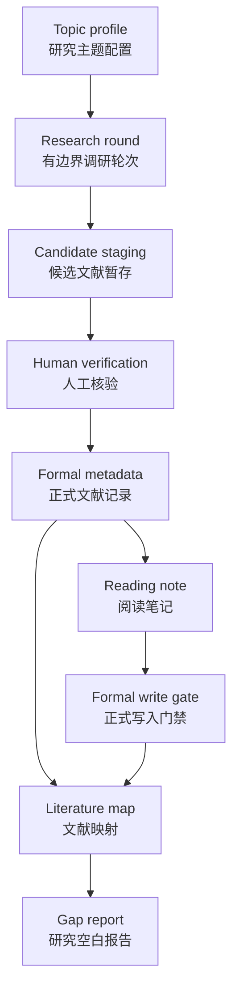

# RSA Research Agent Harness

面向科研文献调研的本地优先 agent harness。它用 Markdown/YAML、CLI 和显式人工确认，把“候选文献 -> 正式元数据 -> 阅读笔记 -> 文献映射 -> 研究空白报告”串成一条可审计、可回滚、可长期维护的证据链。


## 为什么需要它

LLM/agent 很适合辅助文献调研，但科研记录不能被未核验的模型判断污染。RSA 的核心目标是：让 agent 的每一步输出都能追溯到来源、状态和人工确认。

这个项目适合：

- 博士课题、长期科研项目和文献综述整理。
- 需要保留 PDF、截图、阅读笔记和研究判断依据的本地工作流。
- 希望使用 agent 提速，但不希望 agent 自动写入正式科研记录的场景。

## 核心能力

| 能力 | 说明 |
|------|------|
| Topic profile | 用 YAML 定义研究主题、关键词、优先问题、指标和排除范围。 |
| Research round | 创建有边界的文献调研轮次，保留目标、限制、候选和追踪摘要。 |
| Metadata gate | 只有经过人工确认的文献才能进入 `metadata/P###.yaml`。 |
| Candidate staging | 候选文献和核验记录先停留在 staging，不会自动进入正式记录。 |
| Literature map | 将已验证文献映射到 topic、priority question、章节和计划产出。 |
| Reading note | 只基于本地、用户提供或已授权全文创建单篇阅读笔记。 |
| Source ledger | 登记本地、用户提供、open access 或已授权全文来源，不自动修改正式 metadata。 |
| Asset manifest | 登记截图、图表、结果图和补充资产，真实文件 local-only，manifest 可审计。 |
| Formal write guardrails | 正式写入必须通过 schema 校验、冲突检查和显式人工确认。 |
| Harness evals | 用本地 deterministic fixtures 检查回归、越界写入和格式漂移。 |

## 工作流



## 安装

```powershell
# 克隆仓库后进入项目目录
cd RSA

python -m venv .venv
.\.venv\Scripts\Activate.ps1
python -m pip install -e ".[dev]"

rsa --help
```

如果没有安装 editable package，也可以用：

```powershell
python -m rsa_cli.cli --help
```

## 快速体验

初始化本地文献工作区：

```powershell
rsa --root . init
```

校验内置 SAR starter profile：

```powershell
rsa --root . validate-profile 01_literature/topic_profiles/sar_noncontinuous_aperture.yaml
```

创建一个有边界的调研轮次：

```powershell
rsa --root . new-round `
  --topic 01_literature/topic_profiles/sar_noncontinuous_aperture.yaml `
  --objective "调研间断孔径 SAR 文献" `
  --name "gap sar starter"
```

校验并生成追踪摘要：

```powershell
rsa --root . round validate R001_gap_sar_starter
rsa --root . round trace R001_gap_sar_starter
```

运行 harness 回归检查：

```powershell
rsa --root . eval run
rsa --root . eval compare
```

## 常用命令

| 命令 | 作用 |
|------|------|
| `rsa init` | 创建本地文献工作区结构和模板。 |
| `rsa validate-profile` | 校验 topic profile YAML。 |
| `rsa new-round` | 创建有边界的文献调研轮次。 |
| `rsa round validate` | 只读校验 round archive。 |
| `rsa round trace` | 生成或刷新 `trace_summary.md`。 |
| `rsa add-paper` | 通过人工确认写入正式 metadata。 |
| `rsa validate-index` | 校验 `paper_index.md` 是否与 metadata 一致。 |
| `rsa regenerate-index` | 根据 metadata 重建文献索引。 |
| `rsa map validate` | 只读校验 `literature_map.md`。 |
| `rsa map propose` | 从 round 输出生成 map 建议，不写正式记录。 |
| `rsa gap generate` | 生成研究空白报告。 |
| `rsa note create` | 从已授权全文创建单篇 reading note。 |
| `rsa source add` / `validate` / `status` | 登记、校验或查看本地/已授权全文来源。 |
| `rsa asset add` / `validate` / `status` | 登记、校验或查看截图、图表和结果图资产。 |
| `rsa formal apply-map` | 经人工确认后写入正式 literature map。 |
| `rsa formal apply-note` | 经人工确认后写入 note 派生的正式记录。 |
| `rsa eval run` / `baseline` / `compare` | 运行本地 eval、更新基线或比较回归。 |

## 项目结构

```text
01_literature/
  metadata/                 # 正式文献 metadata: P###.yaml
  topic_profiles/           # 研究主题 profile
  agent_outputs/            # 有边界的 round archive
  notes/                    # P###_reading_note.md
  synthesis/                # gap report 和 eval report
  sources/                  # P###.yaml 来源 ledger
  pdfs/                     # 本地-only PDF，git 忽略
  assets/                   # 本地-only 截图/结果图；manifest.yaml 可审计
  paper_index.md            # 正式 metadata 索引
  literature_map.md         # 正式文献到主题的映射
  agent_research_notes.md   # 人工确认后的辅助研究笔记
templates/                  # 用户可编辑模板
src/rsa_cli/                # CLI 和 harness 实现
tests/                      # 回归测试
.planning/                  # GSD 计划、里程碑归档和状态
```

## 安全边界

- 候选证据不会自动成为正式 metadata。
- `metadata/P###.yaml` 写入必须带 `--human-confirmed` 和 `--confirmed-by`。
- `rsa source add` 和 `rsa asset add` 只登记来源/资产 ledger，不自动修改正式 metadata。
- 缺失或未授权 PDF 只会生成 blocked 状态记录，不会生成假的 reading note。
- `validate` 命令必须只读。
- `generate` 和 `propose` 可以生成建议文件，但不能修改正式记录。
- 正式写入遇到 schema 错误、缺少确认、重复或冲突时必须失败。
- Eval report 和 trace summary 是审计材料，不是学术结论。

## 开发

安装开发依赖：

```powershell
python -m pip install -e ".[dev]"
```

运行测试：

```powershell
python -m pytest -q
```

运行 harness 回归比较：

```powershell
rsa --root . eval compare
```

当前 v1.0 归档基线：`94 passed`，`eval compare` 结果为 `regressions=0`。

## 项目状态

- 当前里程碑：`v1.0 Local Harness`
- 当前版本：`v2.0` Phase 6 完成
- 状态：v1.0 已归档；v2.0 已开始，下一步是 Phase 7
- 主要用户语言：中文
- 字段名、YAML key、表格列、CLI flag、命令名和代码标识：保持英文稳定

## 路线图

v2 建议优先扩展这些方向：

1. PDF 和截图资产管理。Phase 6 已建立 source ledger 和 asset manifest 基础。
2. 授权全文获取和自动下载。
3. 自动阅读草稿。
4. 结构化证据抽取。
5. AI 辅助评分：相关性、质量和阅读优先级。
6. 批量候选文献导入和 campaign review queue。
7. DOI/Crossref/OpenAlex 等 scholarly API 进入 staging。
8. 本地 review UI。
9. Claim-level citation check。
10. 更强的 research-quality evals。
11. 可选 multi-agent orchestration。

更多 GSD 文档：

- `.planning/MILESTONES.md`
- `.planning/milestones/v1.0-ROADMAP.md`
- `.planning/milestones/v1.0-REQUIREMENTS.md`
- `.planning/v2-DISCUSSION.md`
- `.planning/RETROSPECTIVE.md`

## 许可证

当前仓库还没有声明许可证。公开发布前建议补充 `LICENSE`，明确复用、分发和引用方式。
